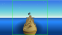

# grouppuffle

Decentralized multiplayer, 2d vector graphics, sandbox MMO.

## Hosting
Requires node js runtime

GitIgnore is not configured for ignoring node_modules, which means you do not have to run `npm install`

Run `npm run start` in your terminal

## Joining
Open URL revealed in terminal in your web browser

